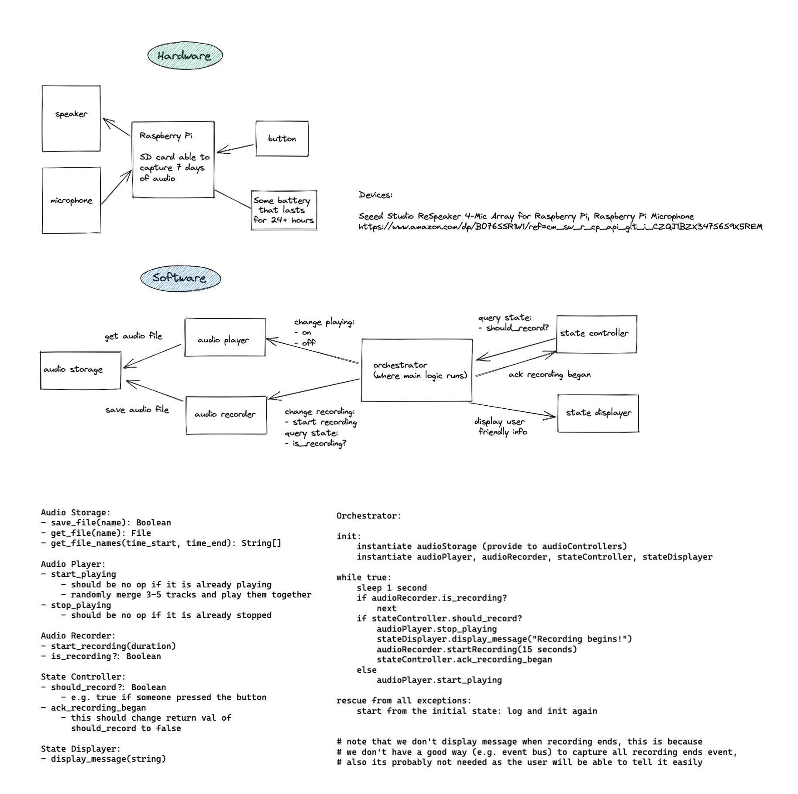

# Burning Man 2022 Project

### Start the collector program
`python3 conversation_collector`

To auto run at boot:

`cp -r /etc/xdg/lxsession ~/.config/` *only If you don't have ~/.config/lxsession already*

`nano ~/.config/lxsession/LXDE-pi/autostart`

add `@lxterminal -e python3 /home/milton/Desktop/conversation_collector/`

## Priorities
[Prio] until 5/31

### Art
- [MED][---] Sound sculpture - design & implement different play styles
  - By implementing sculptor.reshape_audio() logic
- [LOW][---] Sound sculpture - switch to different styles per hour in day / number of files / etc.
  - By implementing sculptor.reshape_audio() logic
### Platform
- [MEDIUM][---] Recorder - develop a better algorithm to handle silent recordings
  - we shouldn't normalize silent recordings to -20 which will create a constant loud static noise
  - maybe when all recording is universally low, either don't normalize or don't save
- [LOW][---] UI/UX - add more ideas / poems to the Poet
### Hardware
- [HIGH][milton] Design & implement power solution - solar / batteries
  - https://hive.burningman.org/posts/14167796
  - https://forums.raspberrypi.com/viewtopic.php?t=96544
  - https://howchoo.com/g/mmfkn2rhoth/raspberry-pi-solar-power
- [HIGH][milton] Make a POC shell
  - ...and assemble it with full features. Then schedule time to demo this around.
- [MED][milton] Build the Playa Pole
- [LOW][---] Make a robust and aesthetically pleasing shell
  - Ideally we can have some artist to do this
  - Directly out of wood? or 3D printed w/ heat-resistant materials?
- [LOW][---] Playa installation solution: Harsh environment
  - the whole thing needs to be resistant to STRONG wind / heat / rain
  - https://forums.raspberrypi.com/viewtopic.php?t=54812
  - https://forums.raspberrypi.com/viewtopic.php?f=63&t=44684
### Production Checklist
- [todo] Orchestrator - remove exception "I don't feel like humming anymore." when ready for production.
- [todo] private beta indoors for 3 days
- [todo] public beta outdoors (with solar) for 12 hours+

## Notes

### Package Dependency 
- Stable OS: Raspberry Pi OS (32-bit) `Release 2022-04-04; installed with Raspberry Pi Imager v1.7.2`
- wave `pip3 install wave`
- RPI.GPIO `pip3 install RPi.GPIO`
- numpy `pip3 install numpy`
- pydub `pip3 install pydub`
- pyaudio `pip3 install pyaudio`
- ESPEAK-NG `sudo apt-get install espeak && pip3 install speake3`

### Hard-wiring / Setup
- Make sure to update the hard-coded path in files_manager.py `ROOT_PATH` and create sub-directories
- Also updates `DEVICE_NAME` if you use a different speaker-mic than Jabra SPEAK 410

## Design
*Installation Design*

*Software Design, but mostly outdated*

